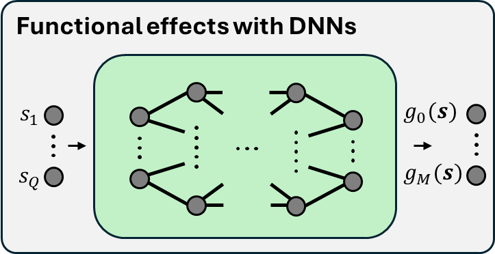
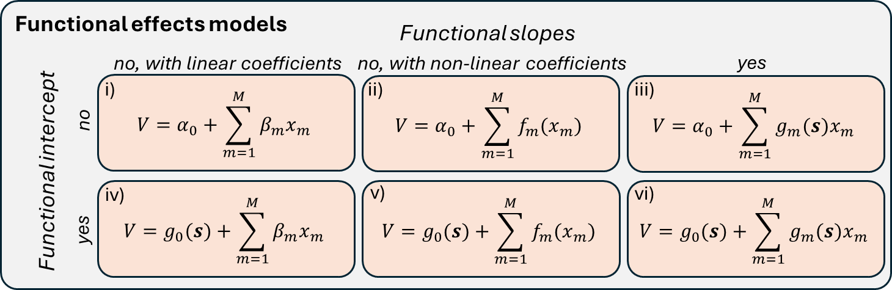

# Functional effects models: Accounting for preference heterogeneity in panel data with machine learning
<p float="left">
  
  
  
</p>

[](https://github.com/NicoSlvd/rumboost) 

[](https://github.com/big-ucl/functional-effects-model/actions/workflows/python-package.yml)
[](https://doi.org/10.48550/arXiv.2509.18047)


Repository to reproduce results from [our paper](https://doi.org/10.48550/arXiv.2509.18047) on functional effects where we learn individual-specific intercepts and coefficients from the socio-demographic characteristics to account for inter-individual heterogeneity in panel data.

---
# Installation

To run the functional effects models, we recommend to clone this project and install its dependencies in a new environement. We recommend to use the [conda](https://www.anaconda.com/download) python package manager. 
To clone the project, create a new environement and install the required dependencies, run the following commands:

```
git clone git@github.com:big-ucl/functional-effects-model.git
cd functional-effects-model
conda create -n func_effects_model python
pip install -r requirements.txt
```

---
# Running a model

To run a functional effects, navigate in the [src](src/) folder and run this command:

```
python main.py --args_names args_values
```
The main arguments to specify are:
- functional_intercept: "true"/"false" to run with or without functional intercept;
- functional_params: "true"/"false" to run with or without functional slopes;
- dataset: "SwissMetro"/"LPMC"/"easySHARE", which dataset to run the model on; and
- model: "RUMBoost"/"TasteNet"/"GBDT"/"DNN"/"MixedLogit", which model to use: "RUMBoost" for functional effects with GBDT, "TasteNet" for functional effects with DNNs, "GBDT" blackbox GBDT, "DNN" blackbox DNN and "MixedLogit" for a Random intercept model. Note that not all models are implemented on all datasets.
- optimal_hyperparams: "true"/"false", to run the models with optimal hyperparameters form the hyperparameter search, otherwise will run with default or specified hyperparameters.

See the [parser](src/parser.py) for all arguments that can be specified.

# Adding a new dataset
To run the functional effects models with new datasets, you will need to add your dataset in the [data](data/) folder, and add its path and model structure to the [constants](src/constants.py) file. Finally, the data loading in the [train](src/train.py) and [hyperparameter search](src/hyperparameter_search.py) files will need to be adapted. Note that in case of monotonic constraints, you will have to specify it in [here](https://github.com/big-ucl/functional-effects-model/blob/e3f4f52d623ef290dc3d2023907e843eabc9d874/src/utils.py#L24C5-L24C27) for GBDT and [here](https://github.com/big-ucl/functional-effects-model/blob/e3f4f52d623ef290dc3d2023907e843eabc9d874/src/tastenet/models.py#L111) for DNNs.

# Running results from the paper

The case studies can be reproduced by running the [run_models.py](src/run_models.py) script, with correct arguments and dataset in the data folder. Note that to run models on the easySHARE dataset, you will need to add and pre-process it beforehand.

The hyperparameter search can be reproduced by running the [hyperparameter_search.py](src/hyperparameter_search.py) python script.

The synthetic experiment can be reproduced by running the [synthetic_experiment.py](src/synthetic_experiment.py) python script.

The easySHare dataset pre-processing can be done by running the [data_preprocessing.ipynb](src/data_preprocessing.ipynb) jupyter notebook.

Finally, [models_wrapper.py](src/models_wrapper.py) contains all models wrapped in consistent classes from their source code.
